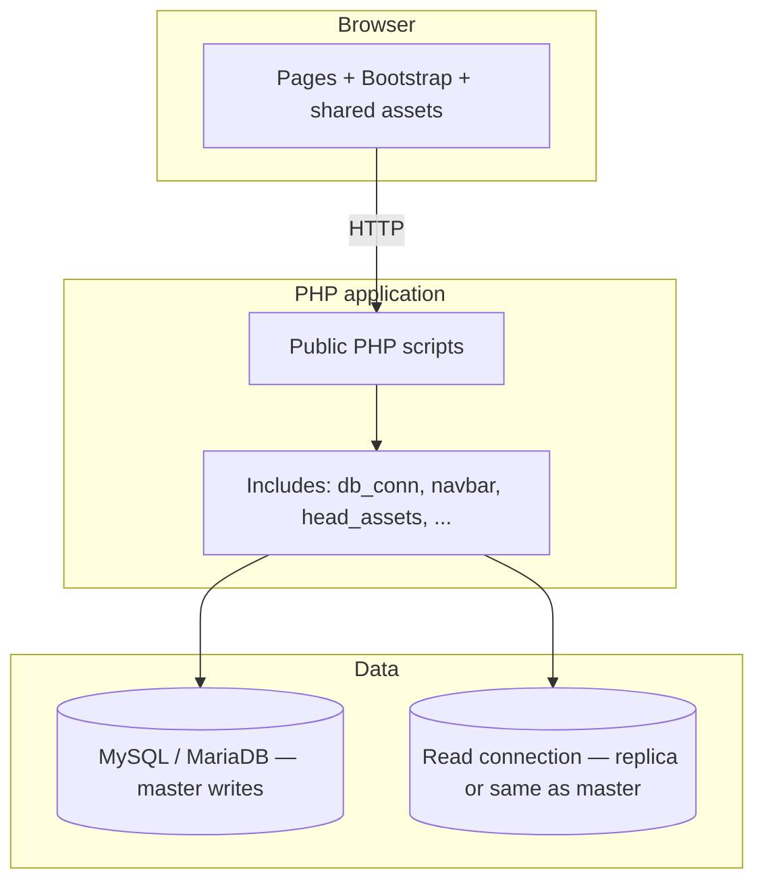
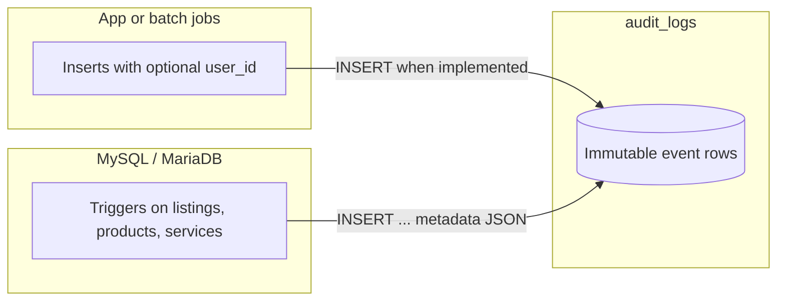

# WVSU Connect — System & database documentation

**Audience:** Developers, admins, and anyone onboarding to the codebase or schema.  
**Scope:** Architecture, major features, data model, ER diagram usage, and local setup.  
**Companion:** For ERD editing and FK details only, see [`wvsudb-erd.md`](wvsudb-erd.md).

---

## Table of contents

1. [What this system is](#1-what-this-system-is)
2. [Technology stack](#2-technology-stack)
3. [High-level architecture](#3-high-level-architecture)
4. [Runtime model (requests, sessions, DB)](#4-runtime-model-requests-sessions-db)
5. [Project layout (where to look)](#5-project-layout-where-to-look)
6. [User roles and main flows](#6-user-roles-and-main-flows)
7. [Feature areas (mapped to PHP)](#7-feature-areas-mapped-to-php)
8. [Database design & ERD](#8-database-design--erd)
9. [Schema evolution (migrations)](#9-schema-evolution-migrations)
10. [Configuration & local development](#10-configuration--local-development)
11. [Operational notes](#11-operational-notes)
12. [Audit logs & database triggers](#12-audit-logs--database-triggers)
13. [Related files](#13-related-files)

---

## 1. What this system is

**WVSU Connect** is a campus-oriented **student marketplace**: users can browse and list **products** (priced goods with stock) and **services** (rates, portfolios, pricing lines), negotiate in ** Messages**, complete **transactions**, leave **reviews**, and report issues for **moderation**. An **admin/moderator** surface exists for listings, users, and reports.

The database centers on **`listings`**: one row describes any offer (`listing_type` = product or service). Specialized tables (**`products`**, **`services`**, **`service_portfolio_items`**, **`service_pricing_items`**) attach type-specific facts. **`categories`** provides a shared taxonomy for discovery—not a duplicate “product/service split,” but shelves like *Electronics* or *Academic Help* that apply regardless of fulfillment type.

---

## 2. Technology stack

| Layer | Choice |
|--------|--------|
| **Server-side** | PHP (strict typing in newer files), session-based auth |
| **Database** | MariaDB/MySQL via `mysqli` |
| **Front end** | HTML, Bootstrap 5.x, Bootstrap Icons, shared CSS (`css/wvsu-connect-theme.css`), motion/helpers (`js/wvsu-motion.js`, entry splash loaders) |
| **Diagrams** | Mermaid `.mmd` for ER (import into diagrams.net/draw.io) |

There is **no** separate REST API or SPA layer in this repo: each page is typically a **PHP script** that runs queries and renders HTML.

---

## 3. High-level architecture



- **Writes** (insert/update/delete) use **`$master_conn`**.
- **Reads** use **`$slave_conn`** when a separate replica is configured; if the secondary port is down, code **falls back to the master** so local XAMPP works with a single server.

---

## 4. Runtime model (requests, sessions, db)

### 4.1 Bootstrap

Most pages include:

1. **`db_conn.php`** — connects to MySQL, `session_start()`, defines `fetch` / `fetchAll` (slave) and `fetch_master` (master), plus small **idempotent** DDL for helper objects (e.g. `conversation_listings` if missing, portfolio/pricing/messaging helpers).
2. **`head_assets.php`** — theme CSS, icons, favicon, optional entry-loader assets, version query strings for cache busting.
3. **`navbar.php`** (where used) — nav, branding, session-aware links, unread message counts, admin link when `role_id` indicates admin.

Auth state lives in **`$_SESSION`** (e.g. `user_id`, `role_id`).

### 4.2 Post-login redirects

`wvsu_auth_redirect.inc.php` exposes **`wvsu_login_redirect_destination()`**: only **relative, same-site** paths on an allowlist (e.g. `addproduct.php`, `messages.php`, `profile.php?id=…`) are honored from `?next=` or `redirect_after`—no open redirects.

### 4.3 Why `fetch` vs `fetch_master`

- **`fetch` / `fetchAll`** — ordinary reads; fine for catalog browsing.
- **`fetch_master`** — used when the UI must reflect a **write you just made** without replica lag (e.g. homepage counts after publishing).

---

## 5. Project layout (where to look)

| Area | Examples |
|------|-----------|
| **Public entry** | `index.php`, `index.html` (redirect to `index.php`) |
| **Auth** | `login.php`, `register.php`, `process-login.php`, `process-register.php`, `logout.php` |
| **Marketplace** | `products.php`, `services.php`, `view-product.php`, `view-service.php`, `addproduct.php`, `addservice.php`, `your_listings.php`, `edit_listing.php` |
| **Commerce** | `process-buy.php`, `confirm_purchase.php`, `complete_transaction.php`, `process-update-stock.php` |
| **Social / trust** | `profile.php`, `edit_profile.php`, `process-review.php`, `safety.php` |
| **Messaging** | `messages.php`, `message_media.php`, `messaging_schema.inc.php` |
| **Moderation** | `admin_dashboard.php`, `process-admin-action.php`, `process-report.php`, `moderation.inc.php` |
| **Infra** | `db_conn.php`, `db_config.local.example.php`, `wvsu_upload_dirs.inc.php` |
| **Branding/UI** | `css/wvsu-connect-theme.css`, `navbar.php`, `footer.php`, `head_assets.php` |
| **Schema** | `wvsudb.sql`, `migrations/*.sql`, `diagrams/wvsudb-erd.mmd` |

This is illustrative, not exhaustive—grep for `include`/`require` from your feature entry point.

---

## 6. User roles and main flows

| Role | Typical capabilities |
|------|---------------------|
| **Guest** | Browse `index.php`, `products.php`, `services.php`; prompted to **log in** to sell or message. |
| **Student user** (`users` row, non-admin role) | List products/services, edit own listings, buy (transactions), chat, edit profile, write reviews/reports. |
| **Admin** (`role_id` corresponding to admin in app; **`admin_dashboard.php`** guarded) | Moderation workflows on listings/reports/users as implemented. |

**Typical journeys**

1. **Discover** → browse categories/listings → open detail (`view-product.php` / `view-service.php`).
2. **Purchase / book** → transaction flow scripts build rows in **`transactions`** and **`product_orders`** or **`service_bookings`** depending on listing type.
3. **Communicate** → **`conversations`** + **`messages`**; optional linkage to listings via **`conversation_listings`** (app-maintained association).
4. **Trust** → **`reviews`** (transaction-linked, unique `transaction_id`) and **`user_reviews`** (peer-centric); **`user_reports`** and admin tooling.

---

## 7. Feature areas (mapped to PHP)

### 7.1 Listings catalog

- **Browse** filtered listing queries with joins to **`categories`**, **`products`**, or **`services`** as needed.
- **Detail** views resolve `listing_type` and join the extension table (`products`/`services`).
- **Your listings** — seller-facing management and stock updates where applicable (`process-update-stock.php` pattern).

### 7.2 Commerce

- **`transactions`** is the canonical order/booking header: buyer, listing, totals, status.
- **Product-specific** fulfillment fields live in **`product_orders`** (1:1 with transaction via `transaction_id`).
- **Service-specific** scheduling/agreement fields live in **`service_bookings`** (also 1:1 with transaction).
- Seller identity comes from **`listings.owner_id`**, not duplicated on every transaction row.

### 7.3 Messaging

- **`conversations`** stores two participants; **`messages`** stores content and metadata.
- **`conversation_meta`** stores per-thread flags (e.g. closed), keyed by `conversation_id`.
- **`conversation_listings`** links threads to **which listings** are being discussed; indexes exist in SQL; **foreign keys may not be declared** in the dump—treat as **application-enforced** integrity.

### 7.4 Reviews and reports

- **`reviews`** — legacy/transaction-based; **unique** `transaction_id` → at most one review per completed sale path.
- **`user_reviews`** — reviewer/reviewee + optional listing for profile-style feedback.
- **`user_reports`** — moderation pipeline; may reference **users**, **listings**, and optionally **`conversation_id`** (column present; **FK to `conversations` may be absent** in SQL—documented in the ERD companion).

### 7.5 Audit and admin

- **`audit_logs`** — append-only event stream; see [§12](#12-audit-logs--database-triggers) for schema, **MariaDB/MySQL triggers**, and how that differs from PHP-written rows.
- **`admin_actions`** — structured rows for **moderator/admin** actions (ban, resolve report, etc.), separate from the general **`audit_logs`** stream.

---

## 8. Database design & ERD

### 8.1 Canonical sources of truth

| Artifact | Role |
|----------|------|
| **`wvsudb.sql`** | Table definitions, indexes, and **`ALTER TABLE … ADD CONSTRAINT`** foreign keys. |
| **`diagrams/wvsudb-erd.mmd`** | Mermaid **erDiagram** for visualization (diagrams.net, Mermaid Live, etc.). |
| **`docs/wvsudb-erd.md`** | How to read the diagram, domain grouping, combined-edge labels, omitted test tables. |

### 8.2 Why the ERD can differ slightly from “SQL line by line”

- **Draw.io / Mermaid UX:** The **`categories` self-FK** (`parent_type` → `categories.category_id`) is **real in SQL** but may be **omitted as an edge** in `.mmd` because same-table edges render as broken long curves—see `wvsudb-erd.md`.
- **Logical relationships:** Some lines (e.g. **`conversation_listings`**, optional **`user_reports.conversation_id`**) reflect **application intent** where the dump has **indexes but no FK**—the narrative in [`wvsudb-erd.md`](wvsudb-erd.md) calls these out.
- **Combined edges:** When two FKs go from one table to **`users`** (e.g. both participants in **`conversations`**), the diagram may show **one labeled edge**; exact column names are in the entity blocks and in SQL.

### 8.3 Subsystems (short)

1. **Identity** — `roles`, `users`, `user_sessions`.
2. **Catalog** — `categories`, `listings`, `products`, `services`, `service_portfolio_items`, `service_pricing_items`, `item_status`.
3. **Commerce** — `transactions`, `product_orders`, `service_bookings`.
4. **Reviews** — `reviews`, `user_reviews`.
5. **Messaging** — `conversations`, `messages`, `conversation_meta`, `conversation_listings`.
6. **Governance** — `user_reports`, `admin_actions`, `audit_logs`.

### 8.4 Tables intentionally out of the product ERD

Test-only tables such as **`replication_live_test`**, **`uploaded_files_test`** may appear in dumps but are **not** part of the product model in [`diagrams/wvsudb-erd.mmd`](../diagrams/wvsudb-erd.mmd).

---

## 9. Schema evolution (migrations)

Ordered SQL under **`migrations/`** documents incremental changes (portfolio, pricing, reports, messaging media, XAMPP alignment, seeds, etc.). Treat **`wvsudb.sql`** as the **single full snapshot** for fresh imports; use migrations when you need to **upgrade** an older database stepwise or to understand **when** a feature landed.

---

## 10. Configuration & local development

### 10.1 Database

1. Create database (default name in config: **`wvsudb`**).
2. Import **`wvsudb.sql`** (phpMyAdmin or CLI).
3. If MySQL has a password, copy **`db_config.local.example.php`** → **`db_config.local.php`** and set credentials (file is gitignored).

### 10.2 PHP / XAMPP

- Place the project under your web root (for example **`htdocs/WVSUCONNECT`**).
- Ensure PHP has **`mysqli`** (and **`mysqlnd`** for `stmt->get_result()` as used by `fetch` helpers).
- Open **`http://localhost/WVSUCONNECT/`** (path depends on folder name).

Optional env vars (`WVSU_DB_*`, `WVSU_DB_MASTER_PORT`, `WVSU_DB_SLAVE_PORT`) adjust host and replication ports for advanced setups.

### 10.3 Deploy sync (optional script)

Repo root **`sync-to-htdocs.sh`** mirrors the tree into **`/Applications/XAMPP/xamppfiles/htdocs/WVSUCONNECT`** (customize `WVSU_HTDOCS` if needed). Excludes `.git` and avoids deleting extra files under htdocs (no `--delete`).

---

## 11. Operational notes

- **Safety & meetups:** `safety.php` and copy on the homepage emphasize **campus-appropriate** behavior; this is guidance, not a substitute for institutional policy.
- **Uploads:** Image paths for listings/media follow conventions under `wvsu_upload_dirs.inc.php`-related helpers—keep directories writable where your host expects uploads.
- **Performance:** Prefer **`fetch`** for read-heavy listings; **`fetch_master`** when consistency with a just-committed write matters.

---

## 12. Audit logs & database triggers

This section describes **`audit_logs`** and the **`TRIGGER`** definitions shipped in **`wvsudb.sql`**. Canonical SQL lives in that file (`grep -n TRIGGER wvsudb.sql`). A parallel extract also exists as **`wvsudb_expanded.sql`** with trigger commentary.

### 12.1 What `audit_logs` is for

| Goal | Detail |
|------|--------|
| **Operational history** | Who did what—logins, listing/catalog changes, product/service row lifecycle. |
| **Structured payload** | `metadata` must be **`NULL` or JSON** (MariaDB/MySQL **`CHECK (json_valid(metadata))`** on `wvsudb.sql`). |
| **`user_id`** | Optional FK to **`users`** (`ON DELETE SET NULL`). Populated when the **application** inserts a row and knows the acting user; **trigger-written rows omit `user_id`** because triggers have no PHP session context. |

**Columns (summary)**

| Column | Meaning |
|--------|---------|
| `log_id` | Surrogate PK (auto-increment). |
| `user_id` | Acting user when known (often NULL for trigger-only inserts). |
| `event_type` | Short label, e.g. `USER_LOGIN`, `PRODUCT_UPDATED`. |
| `entity_type` / `entity_id` | What object the row refers to (`listing`, product id, etc.). |
| `metadata` | JSON object with event-specific keys (diffs, titles, FK ids). |
| `logged_at` | Server timestamp (default **`current_timestamp()`**). |

**Not the same table as:**

- **`admin_actions`** — one row per **moderation** action (`action_type`, `target_entity_id`, …).
- **`item_status`** — **history of listing status** changes; populated **by trigger** alongside an `audit_logs` row when **`listings.status`** changes.

### 12.2 Two ways rows get into `audit_logs`



1. **Application or jobs** can **`INSERT`** into **`audit_logs`** when you need user-attributed events (`USER_LOGIN`, `ORDER_CREATED`, etc.). In that case set **`user_id`** when the actor is known. The **`wvsudb.sql`** seed data shows **example** row shapes for auth and listing events; wire your PHP to the same table if you want those events live in production.
2. **Database triggers** (below) always insert rows on **`INSERT` / `UPDATE` / `DELETE`** of **`products`** and **`services`**, and on **`UPDATE`** of **`listings`** when **`status`** changes. Those inserts **do not** set **`user_id`**.

### 12.3 Trigger catalog (as in `wvsudb.sql`)

All triggers write **`event_type`**, **`entity_type`**, **`entity_id`**, **`metadata`** (JSON via **`JSON_OBJECT(...)`**). They do **not** set **`user_id`**.

| Trigger | Table | Timing | Condition | `event_type` | Notes |
|---------|--------|--------|-------------|----------------|------|
| `trg_listing_status_change_log` | `listings` | `AFTER UPDATE` | `OLD.status` ≠ `NEW.status` | `LISTING_STATUS_CHANGED` | Also **`INSERT`**s into **`item_status`** (`listing_id`, `old_status`, `new_status` only). `changed_by` is not set by the trigger. |
| `trg_product_insert_log` | `products` | `AFTER INSERT` | always | `PRODUCT_CREATED` | `metadata`: `listing_id`, `price`, `stock`. |
| `trg_product_update_log` | `products` | `AFTER UPDATE` | price or stock changed | `PRODUCT_UPDATED` | `metadata`: `listing_id`, `old_*` / `new_*` price and stock. |
| `trg_product_delete_log` | `products` | `BEFORE DELETE` | always | `PRODUCT_DELETED` | `metadata`: `listing_id`, `price`, `stock` (from **`OLD`**). |
| `trg_service_insert_log` | `services` | `AFTER INSERT` | always | `SERVICE_CREATED` | `metadata`: `listing_id`, `rate`, `rate_type`. |
| `trg_service_update_log` | `services` | `AFTER UPDATE` | rate or **rate_type** changed | `SERVICE_UPDATED` | `metadata`: old/new rate and rate_type. |
| `trg_service_delete_log` | `services` | `BEFORE DELETE` | always | `SERVICE_DELETED` | Same shape as insert, from **`OLD`**. |

**Design takeaway:** Listing **status** and **commercial fields** tied to **`products`** / **`services`** rows are audited **inside the DB** so direct SQL or tooling cannot bypass PHP and skip history (as long as triggers remain enabled).

### 12.4 Example queries

```sql
-- Latest catalog-related events (adjust LIMIT)
SELECT log_id, user_id, event_type, entity_type, entity_id,
       logged_at,
       JSON_EXTRACT(metadata, '$.new_price') AS new_price
FROM audit_logs
WHERE event_type LIKE 'PRODUCT%' OR event_type LIKE 'SERVICE%' OR event_type = 'LISTING_STATUS_CHANGED'
ORDER BY logged_at DESC
LIMIT 50;
```

```sql
-- Rows where the app recorded the acting user
SELECT * FROM audit_logs WHERE user_id IS NOT NULL ORDER BY logged_at DESC LIMIT 100;
```

### 12.5 Changing or extending triggers

- **Source of truth:** edit **`wvsudb.sql`** (or add a migration that runs **`DROP TRIGGER IF EXISTS ...`** then **`CREATE TRIGGER ...`**).
- **Fresh installs:** re-import **`wvsudb.sql`** after changes.
- **Existing DBs:** apply the same `DROP`/`CREATE` with care in maintenance windows; trigger bodies are plain SQL—test on a copy first.
- **New event types:** keep **`metadata` valid JSON** so the `CHECK` constraint continues to pass.

### 12.6 ERD note

The ER diagram shows **`users` → `audit_logs`** as an optional actor link. **Trigger-generated** rows are still valid with **`user_id` NULL**; interpret the relationship as “may reference a user when the app knew one.”

---

## 13. Related files

| Document / asset | Use |
|------------------|-----|
| [`docs/wvsudb-erd.md`](wvsudb-erd.md) | ERD-only: draw.io paste rules, FK labels, domain sections. |
| [`diagrams/wvsudb-erd.mmd`](../diagrams/wvsudb-erd.mmd) | Editable Mermaid source for the diagram (starts at `erDiagram`). |
| [`wvsudb.sql`](../wvsudb.sql) | Full schema snapshot: tables, constraints, **triggers**. |
| [`wvsudb_expanded.sql`](../wvsudb_expanded.sql) | Alternative dump with trigger section grouped (if present in repo). |

---

*Last aligned with repo layout including: shared head/nav/footer, `db_conn` read/write split, marketplace and messaging modules, **`audit_logs`** + triggers in `wvsudb.sql`, and `diagrams/wvsudb-erd.mmd`. Update this document when you add major features, new triggers, or change global auth/DB behavior.*
